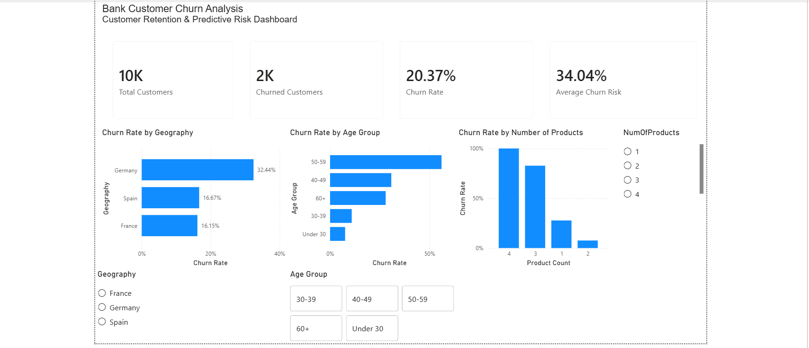
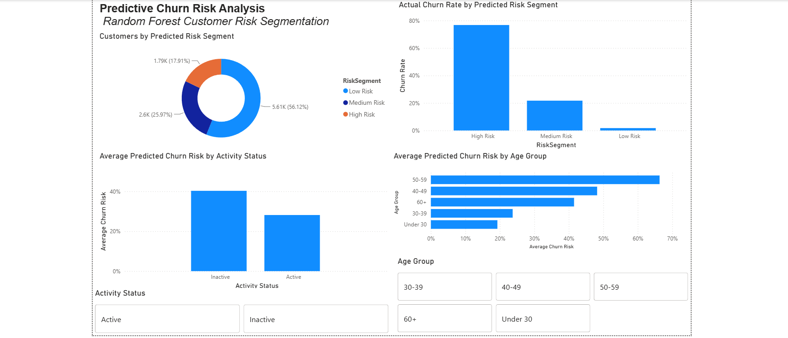

# Bank Customer Churn Analysis

## Project Overview

Customer churn can significantly affect profitability and long-term customer relationships in the banking industry. This project analyzes customer characteristics associated with churn and develops a machine learning model to identify customers with elevated churn risk.

The project follows an end-to-end analytics workflow using **PostgreSQL, Python, Machine Learning, and Power BI**.

The analysis includes:
- SQL-based exploratory analysis
- Python data analysis and visualization
- Predictive modeling using Logistic Regression and Random Forest
- Customer churn risk segmentation
- Interactive Power BI dashboards
- Business recommendations based on the findings

---

## Business Problem

The objective of this project is to answer three main questions:

1. Which customer characteristics are associated with higher churn?
2. Can customer churn risk be predicted using available customer data?
3. How can these insights be translated into actionable customer-retention strategies?

---

## Tools & Technologies

- **PostgreSQL / SQL** — data exploration and customer segmentation
- **Python** — data preparation, exploratory analysis, and modeling
- **Pandas & NumPy** — data manipulation
- **Matplotlib** — data visualization
- **Scikit-learn** — predictive modeling
- **Power BI** — interactive dashboard development
- **Google Colab** — Python development environment

---

## Dataset

The dataset contains **10,000 bank customers** and includes information such as:

- Credit score
- Geography
- Gender
- Age
- Tenure
- Account balance
- Number of products
- Credit card ownership
- Customer activity
- Estimated salary
- Churn status

The target variable is `Exited`, where:

- `0` = Customer retained
- `1` = Customer churned

---

## SQL Analysis

PostgreSQL was used to explore churn patterns across major customer characteristics.

The overall customer churn rate was **20.37%**.

Key findings included:

- Customers in **Germany** had a churn rate of approximately **32.44%**, compared with approximately 16% in France and Spain.
- **Inactive customers** had a churn rate of **26.85%**, compared with **14.27%** for active customers.
- Customers aged **50–59** had the highest age-group churn rate at **56.04%**.
- Customers with **2 products** had substantially lower churn than customers with 1, 3, or 4 products.
- Credit card ownership and tenure showed relatively weak standalone differences in churn.

A rule-based exploratory segmentation was also created to investigate combinations of customer characteristics associated with elevated churn.

---

## Python Analysis & Machine Learning

Python was used for exploratory analysis, feature preparation, and predictive modeling.

Two classification models were evaluated:

| Model | Accuracy | Precision | Recall | F1 Score | ROC-AUC |
|---|---:|---:|---:|---:|---:|
| Logistic Regression | 80.8% | 58.9% | 18.7% | 28.4% | 77.5% |
| Random Forest | 83.4% | 57.8% | 67.3% | 62.2% | 86.5% |

### Model Selection

The **Random Forest model** was selected as the preferred model.

Although Logistic Regression achieved reasonable overall accuracy, it identified only **18.7% of actual churners**.

Random Forest increased churn recall to **67.3%** while achieving a ROC-AUC of **86.5%**, making it considerably more useful for identifying customers who may require retention intervention.

### Important Predictive Features

The Random Forest model identified several influential features, including:

1. Age
2. Number of products
3. Account balance
4. Estimated salary
5. Credit score
6. Customer activity status
7. Geography

Feature importance represents predictive contribution and should not be interpreted as proof that these variables cause churn.

---

## Customer Risk Segmentation

Random Forest churn probabilities were used to create three customer risk segments:

- **Low Risk:** predicted churn probability below 30%
- **Medium Risk:** predicted churn probability from 30% to 60%
- **High Risk:** predicted churn probability above 60%

These segments were incorporated into Power BI to support interactive exploration of customers with elevated predicted churn risk.

---

## Power BI Dashboard

The Power BI report contains two pages.

### Page 1 — Customer Churn Overview

This page provides an overview of observed customer churn and explores churn across characteristics including geography, age, and number of products.



### Page 2 — Predictive Churn Risk Analysis

This page focuses on model-generated churn probabilities and customer risk segmentation, allowing users to explore predicted risk across different customer groups.



---

## Business Recommendations

Based on the exploratory and predictive analysis:

- Prioritize customers with high predicted churn probabilities for targeted retention initiatives.
- Investigate declining customer engagement, as inactive customers demonstrated substantially higher churn.
- Review the customer experience in Germany to understand why churn is considerably higher than in other geographic groups.
- Consider targeted retention strategies for older customer segments, particularly customers aged 40–59.
- Investigate product relationships further before drawing conclusions from customers holding 3–4 products because these groups contain relatively few customers.

---

## Limitations

This project uses a historical public dataset and should be treated as a portfolio analysis rather than a production churn system.

The dataset does not include several factors that could influence churn, such as:

- Customer complaints
- Transaction history
- Service interactions
- Product pricing and fees
- Customer satisfaction
- Changes in customer behavior over time

The analysis identifies associations and predictive relationships rather than causal effects.

Additionally, the risk scores displayed in the Power BI demonstration dataset were generated for the full dataset after model development. Therefore, the held-out test-set metrics are used to evaluate model performance rather than the dashboard scores themselves.

---

## Repository Structure

```text
Bank-Churn-Analysis/
├── data/
│   ├── Churn_Modelling.csv
│   └── bank_churn_powerbi.csv
├── sql/
│   └── churn_analysis.sql
├── python/
│   └── bank_churn_analysis.ipynb
├── power-bi/
│   └── bank_churn_dashboard.pbix
├── images/
│   ├── churn_overview.png
│   └── predictive_risk.png
└── README.md
```

---

## Key Takeaway

This project demonstrates an end-to-end analytics workflow, progressing from **SQL-based exploration to Python predictive modeling and Power BI reporting**. The analysis shows how descriptive and predictive analytics can be combined to identify customer segments associated with churn and support more targeted retention strategies.